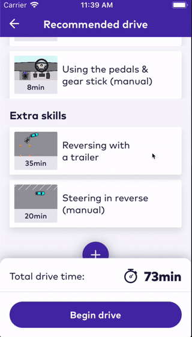
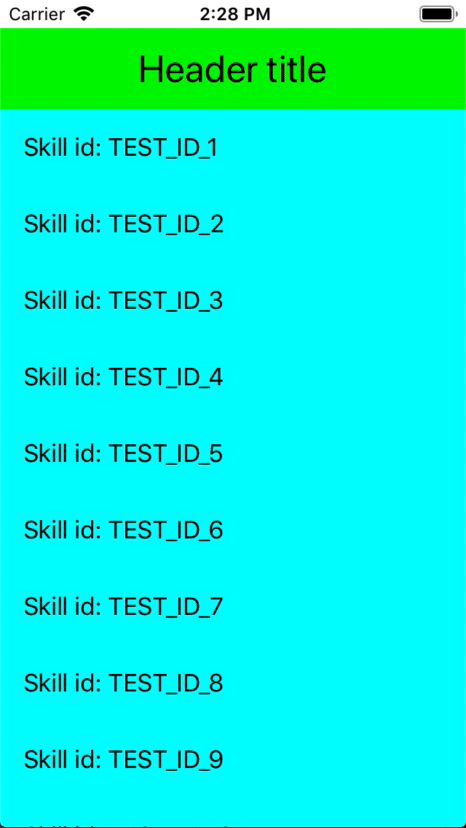
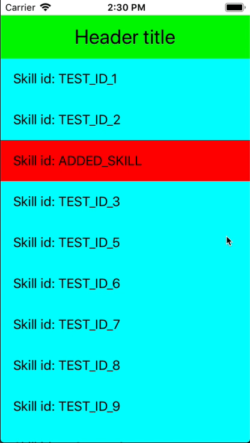

## Overview

How many times have you had to deal with the hassles of manually tracking IndexPath's for a UITableView? Or had an IndexPath related crash?

This is the final code from a medium tutorial https://medium.com/better-programming/how-to-never-have-to-track-a-uitableviews-indexpath-ever-again-a727be52003a on using view models to drive the data flow for UITableView's in iOS. It will walk you through how you can offload all of the manual index tracking of UITableView's and purely drive the data including animations and reloads from simple view models. This allows you to get animations like the following for free.

## Sample code preview

### Inserting a cell

### Deleting a cell

### Stuck or have questions?

Reach out to me on Twitter [@adam_wareing1](https://twitter.com/adam_wareing1)
